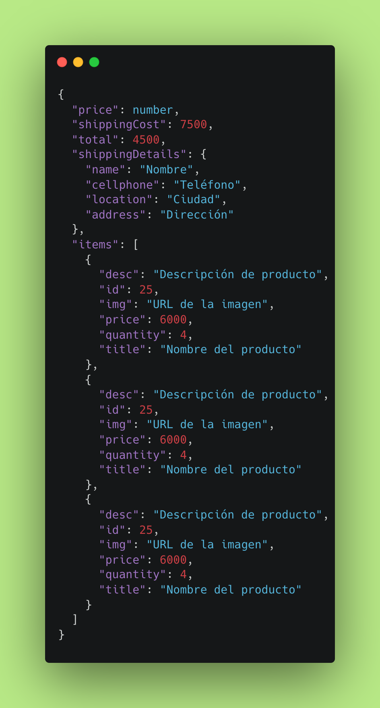

<h2>Endpoints:</h2>

<h3>POST/auth/register</h3>
<h4> Registrar nuevo usuario:</h4>

Enviar en el boddy un JSON: 

{

    "nombre": "string",
    "email": "email",
    "password": "password"
}

Devolverá la información del nuevo usuario registrado. 

<h3>POST/auth/login</h3>
<h4>Logear a un usuario ya registrado:</h4>

Enviar en el boddy un JSON: 

{
    
    "email": "email",
    "password": "password"
}

<h3>PATCH/auth/verify </h3>
<h4>Verificar un usuario:</h4>

Enviar en el boddy un JSON: 
 
{
    
    "nombre": "string",
    "email": "email",
    "code": "code"
}

<h3>GET/orders</h3>
<h4>Obtener ordenes de usuarios registrados y verificados:</h4>

Obtener todas las ordenes realizadas por el usuario actual.

Enviar en el header el JWT del usuario logueado. ( {"x-token": token} )

Retorna un array de objetos con las ordenes realizadas
 
<h3>POST /orders</h3>
<h4>Crear una nueva order de un usuario logueado y verificado</h4>

Enviar en el header el JWT del usuario logueado. ( {"x-token": token} )

Enviar en el body un JSON con los siguientes campos:

Body request order: 

{
  "price": 2000,
  "shippingCost": 7500,
  "total": 4500,
  "shippingDetails": {
    "name": "Nombre",
    "cellphone": "Teléfono",
    "location": "Ciudad",
    "address": "Dirección"
  },
  "items": [
    {
      "desc": "Descripción de producto",
      "id": 25,
      "img": "URL de la imagen",
      "price": 6000,
      "quantity": 4,
      "title": "Nombre del producto"
    },
    {
      "desc": "Descripción de producto",
      "id": 25,
      "img": "URL de la imagen",
      "price": 6000,
      "quantity": 4,
      "title": "Nombre del producto"
    },
    {
      "desc": "Descripción de producto",
      "id": 25,
      "img": "URL de la imagen",
      "price": 6000,
      "quantity": 4,
      "title": "Nombre del producto"
    }
  ]
}

